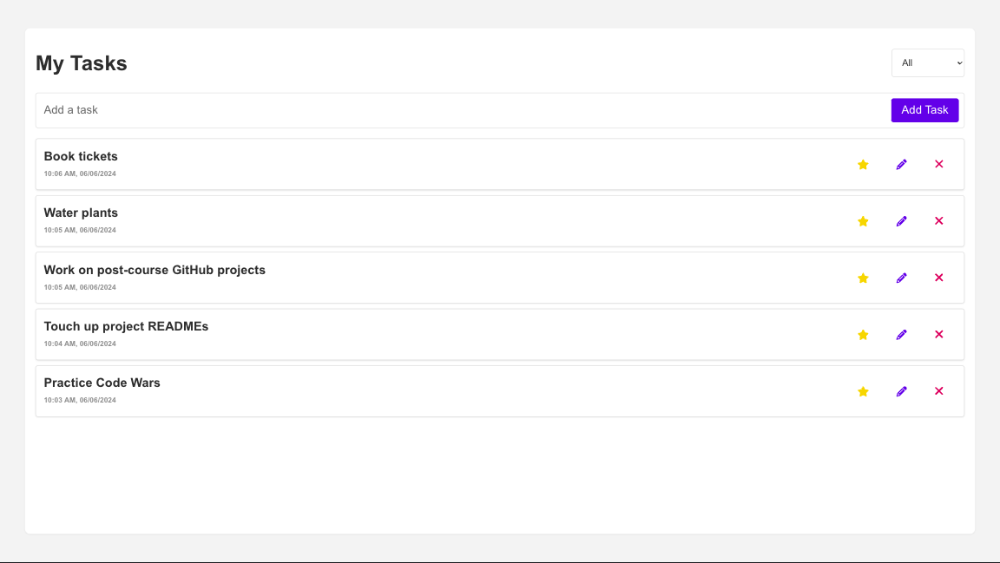

# Task Tracker - Full-Stack Web App

## Project Overview
A comprehensive full-stack task tracking application with complete CRUD functionality, utilizing a Spring Boot API, a TypeScript React UI, and a MySQL database

## Screenshot


## Goals & MVP
MVP
Goals

## Table of Contents
- [Goals & MVP](#goals--MVP)
- [Frontend](#frontend)
- [Backend](#backend)

# Frontend - React Typescript

## Tech Stack

- HTML
- SCSS
- Typescript
- React 
- Git 


## Build Steps
1. How to build/run the project (use proper code snippets)
ex.
  ```bash
  git clone git@github.com:cyberforge1/some-project.git
```

## How To Use
Basic instructions on how to use the application


## Design Goals
- Decisions about project design


## Project Features
- [x] List of specific project features


## Additions & Improvements
- [ ] Desired future features for the app


## Learning Highlights
- New skills and knowledge gained from the project


## Change Logs
List of dates and work provided


## Known Issues
List errors


## Challenges
- List challenges

# Backend - Spring Boot API

## Tech Stack

- HTML
- SCSS
- Typescript
- React 
- Git 


## Build Steps
1. How to build/run the project (use proper code snippets)
ex.
  ```bash
  git clone git@github.com:cyberforge1/some-project.git
```

## How To Use
Basic instructions on how to use the application


## Design Goals
- Decisions about project design


## Project Features
- [x] List of specific project features


## Additions & Improvements
- [ ] Desired future features for the app


## Learning Highlights
- New skills and knowledge gained from the project


## Change Logs
List of dates and work provided


## Known Issues
List errors


## Challenges
- List challenges


## Contact Me
- Visit my [LinkedIn](https://www.linkedin.com/in/obj809/) for more details.
- Check out my [GitHub](https://github.com/cyberforge1) for more projects.
- Or send me an email at obj809@gmail.com
<br />
Thanks for your interest in this project. Feel free to reach out with any thoughts or questions.
<br />
<br />
Oliver Jenkins © 2024
